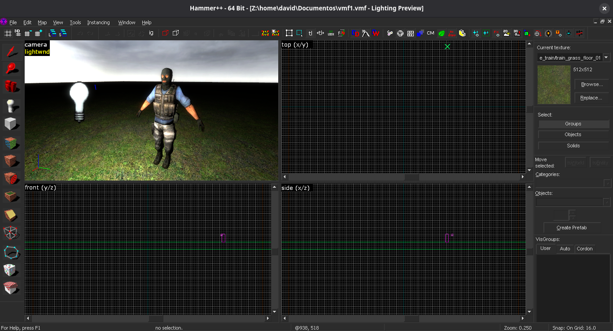

## Installation on Linux

Download the `Linux.7z` file and extract it.
Open Wine settings by running the following in the terminal:

```bash
winecfg
```

Go to the `Desktop Integration` tab, then under Theme select `(No Theme)` and click OK.

After that, go to the `themes` folder inside the extracted `.7z` file and choose either the **Breeze** or **Dark** theme. You can see the difference between them below:

| Dark                     | Breeze                       |
| ------------------------ | ---------------------------- |
|  |  |

Copy the text from the `.txt` file of the theme you chose.
Then, open your Wine `user.reg` file, usually found in the `.wine` folder.
Inside `user.reg`, find the section `[Control Panel\Colors]`, replace its contents with the ones from the `.txt` file, and save `user.reg`.

Paste the folders from the `dll` directory into the `common` folder of your Steam library. For the Flatpak version of Steam, the path is usually:

* `~/.var/app/com.valvesoftware.Steam/.steam/steam/steamapps/common`

If you're using the Windows version of Steam through Wine or a different setup, paste the files into the `common` folder where your games for Hammer++ are located.
