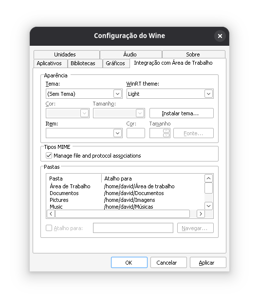
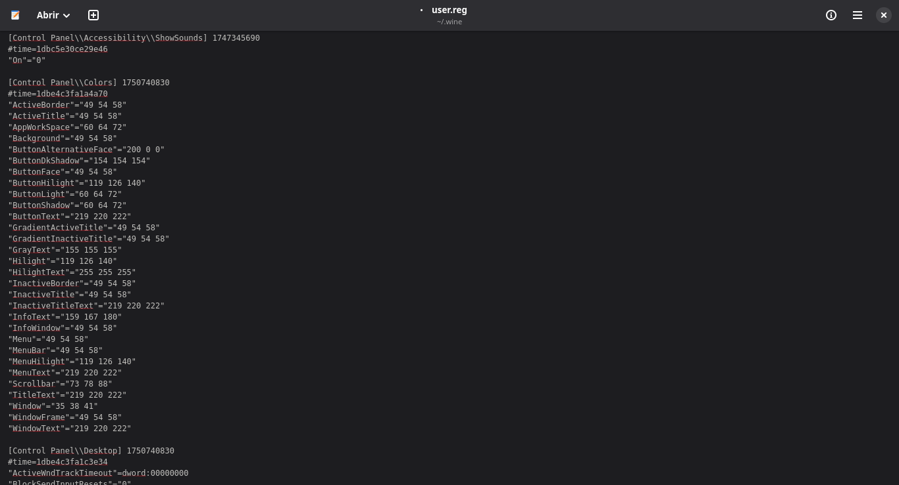

## Instalação no Linux

Baixe o arquivo `Linux.7z` e o extraia.
Abra as configurações do Wine executando no terminal:

```bash
winecfg
```

Vá até a aba `Integração com Área de Trabalho`, depois em Tema selecione `(Sem Tema)` e clique em OK.



Depois disso, vá até a pasta `themes` dentro do `.7z` extraído e escolha entre o tema **Breeze** ou **Dark**. Você pode ver a diferença entre eles abaixo:

| Dark                     | Breeze                       |
| ------------------------ | ---------------------------- |
|  |  |

Copie o texto do arquivo `.txt` do tema escolhido.
Depois, abra o arquivo `user.reg` do seu Wine, normalmente localizado na pasta `.wine`.
Dentro do `user.reg`, localize a seção `[Control Panel\Colors]`, substitua seu conteúdo pelo do `.txt` e salve o `user.reg`.



Cole as pastas da pasta `dll` dentro da pasta `common` da sua Steam. O caminho da versão Flatpak costuma ser:

* `~/.var/app/com.valvesoftware.Steam/.steam/steam/steamapps/common`

Caso esteja usando a Steam do Windows via Wine ou outro caminho diferente, cole dentro da pasta `common` onde estão seus jogos para rodar o Hammer++.