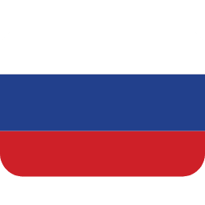
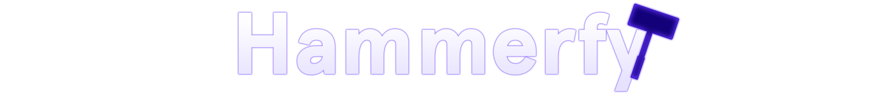

    
    
    

###

###

A Darker++ egy sötét téma telepítő ami a Hammer++ számára, amely egy jobb vizuális élményt nyújt a Hammer++ és a Windows számára egyaránt.

A projekt a Windows sötét témájának alkalmazását kombinálja a Hammer++ DLL-ek cseréjével, biztosítva a program 100%-os működését sötét módban.

https://github.com/user-attachments/assets/1f2c9877-c3d8-48cc-af3a-67eddadee963

##

### Támogatás:

Ha élvezi a Darker++-t, gondolja át, hogy támogasson minket a projekt fejlesztésében. A támogatása segít tovább fejleszteni a programot ❤️

 

##

### Telepítés:

1. Telepítsd a SecureUxTheme.exe-t ami a `7z` fájllal érkezik.
2. Miután telepítetted a SecureUx-et és újraindítottad a számítógépedet, futtasd a telepítőt és kövesd az utasításokat.
3. Válaszd ki azokat a játékokat ahol a Hammer++ telepítve van. A program automatikusan megkeresi őket, de ha nem találja meg, akkor manuálisan ki tudod választani a játék fő mappáját, például a Gmod esetében:
- `C:\Program Files (x86)\Steam\steamapps\common\GarrysMod`
4. Ezután folytasd a telepítést, és kész!

**Manuális telepítés**
1. Telepítsd a SecureUxTheme.exe-t ami a `7z` fájllal érkezik és indítsd újra a számítógépedet.
2. Másold át a mappákat a "dll" mappából a Steam könyvtár "common" mappájába, ami általában a következő helyen található:
- `C:\Program Files (x86)\Steam\steamapps\common` 
3. Másold át a rendszerednek megfelelő mappát és témát a "theme" mappából a Windows témák mappába:
- `C:\Windows\Resources\Themes`
4. Alkalmazd a témát a Gépházban.

**[Telepítés Linux-ra](Docs/HU/Telepítés%20Linuxra.md)**

[Letöltés](https://github.com/source-br/Darkerplusplus/releases)

Ha segítségre van szükséged vagy visszajelzést szeretnél adni, akkor csatlakozz a Discord-szerverünkhöz!

##
> [!NOTE]
> - A Windows frissítések a téma működését el tudják rontani. Ez azért van, mivel a Windows az UltraUXThemePatcher működését elrontja frissítések során. Hogy megjavítsd, telepítsd újra az UltraUXThemePatcher-t, indítsd újra a számítógépét, és alkalmazd újra a témát a Gépházban.

> [!WARNING]
> - Mielőtt használnád a Darker++-t, győződj meg arról, hogy biztonsági mentéseket készítettél a fájlaidról, különösen a Hammer++ beállításaidról. Nem vállalunk felelősséget az adatvesztésért.
> - Amikor egy új Hammer++ verzió kijön, frissíteni fogjuk a telepítőnket, tehát le kell töltened a legújabb telepítő verziót és újra telepíteni a témát.

