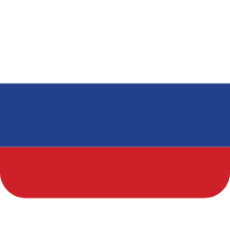

    
    
    
    

###

###

Darker++ es un instalador de tema oscuro diseñado para Hammer++, que ofrece una mejor experiencia visual tanto para Hammer++ como para Windows.

El proyecto combina la aplicación de un tema oscuro en el sistema operativo Windows con el reemplazo de las DLLs de Hammer++, garantizando que el programa funcione 100% en modo oscuro.

https://github.com/user-attachments/assets/1f2c9877-c3d8-48cc-af3a-67eddadee963

##

### Donar:

Si disfrutas de Darker++, considera apoyarnos para el desarrollo del proyecto. Tu apoyo nos ayuda a continuar desarrollando este programa aún más ❤️

 

##

### Instalación:

1. Instala el UltraUXThemePatcher.exe que viene con el archivo `7z`.
2. Después de instalar UltraUX y reiniciar tu computadora, ejecuta el instalador y sigue las instrucciones en pantalla.
3. Selecciona los juegos donde tienes Hammer++ instalado. El programa lo detectará automáticamente, pero si no lo encuentra, puedes seleccionar manualmente la carpeta raíz del juego, por ejemplo, Gmod:
- `C:\Program Files (x86)\Steam\steamapps\common\GarrysMod`
4. Después de eso, completa la instalación, ¡y listo!

**Manualmente**
1. Instala UltraUXThemePatcher.exe que viene con el archivo `7z` y reinicia tu computadora.
2. Copia las carpetas dentro de la carpeta dll en la carpeta common de tu directorio de Steam, usualmente ubicada en:
- `C:\Program Files (x86)\Steam\steamapps\common`
3. Copia la carpeta y el tema que coincida con tu sistema desde la carpeta theme en la carpeta de Temas de Windows:
- `C:\Windows\Resources\Themes`
4. Aplica el tema yendo a Configuración > Personalización > Temas > Darker++. ¡Listo!

**[Instalar en Linux](../Docs/ES/Instalar%20en%20linux.md)**

[Descargar](https://github.com/source-br/Darkerplusplus/releases)

### Correcciones para posibles problemas:

1. Si el tema de tu Hammer sigue siendo blanco, ve a configuración > personalización > temas > Darker++.
2. Si la barra de tareas de Windows no está oscura, ve a configuración > personalización > colores > barras de título y bordes de ventana.

Si necesitas soporte o quieres dar tu opinión, únete a nuestro Discord

##
> [!NOTE]
> - La forma en que funciona Darker puede causar que las actualizaciones de Windows rompan el tema. Esto sucede porque Windows rompe UltraUXThemePatcher durante las actualizaciones. Para solucionarlo, simplemente reinstala UltraUXThemePatcher, reinicia tu computadora, luego ve a "Configuración > Personalización > Temas > Darker++" y vuelve a aplicar el tema.

> [!WARNING]
> - Asegúrate de hacer una copia de seguridad de tus archivos antes de usar Darker++, especialmente tu configuración de Hammer++. No nos hacemos responsables de ninguna pérdida de datos.
> - Siempre que se lance una nueva versión de Hammer++, actualizaremos nuestro instalador, por lo que deberás descargar la última versión del instalador y reinstalar el tema.

